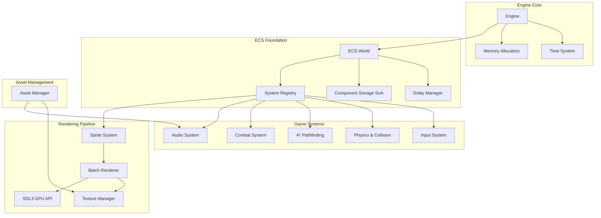
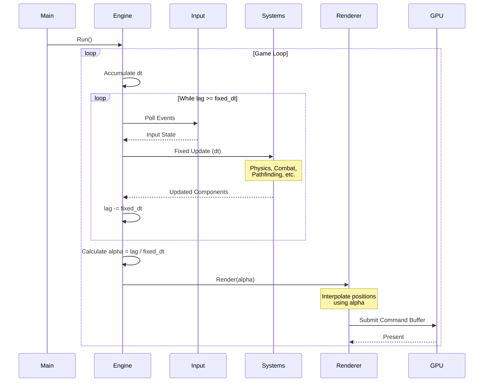
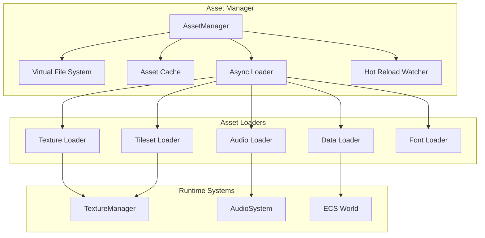
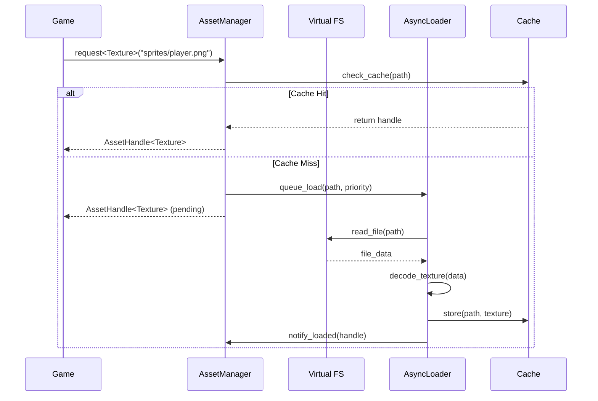

# High-Performance 2D Game Engine Architecture

## Overview
This engine is built on a pure Entity Component System (ECS) architecture with Data-Oriented Design (DoD) principles, leveraging SDL3 and the SDL3 GPU API for high-performance 2D rendering.

## Core Design Principles

### 1. ECS-First Architecture
- **Pure ECS**: Entities are IDs, Components are pure data (SoA layout), Systems are logic
- **Data-Oriented Design**: Structure-of-Arrays (SoA) for cache-line efficiency
- **Zero virtual dispatch**: Systems operate on component arrays directly

### 2. Memory Management
- **Zero-allocation main loop**: All frame allocations use arena/pool allocators
- **Cache-line awareness**: 64-byte alignment for hot data structures
- **Predictable access patterns**: Linear memory traversal in systems

### 3. Fixed Timestep Loop
- **Deterministic updates**: Fixed timestep (e.g., 60 Hz) for physics/logic
- **Interpolated rendering**: Smooth visuals independent of update rate
- **Time control**: Pause, slow-motion, fast-forward support

### 4. GPU-Driven Rendering
- **Batch rendering**: Minimize draw calls via texture atlases and instancing
- **Command buffers**: Decouple CPU and GPU work
- **Transfer buffers**: Async uploads for dynamic geometry

## System Architecture



## Data Flow: Frame Loop



## Module Descriptions

### ECS Core (`include/ecs/`)
- **Entity**: Type-safe entity IDs (32-bit index + 32-bit generation)
- **Component**: SoA storage with cache-friendly iteration
- **System**: Interface for logic operating on component arrays
- **World**: Coordinates entity creation, component storage, system execution

### Memory Management (`include/memory/`)
- **ArenaAllocator**: Linear allocator, reset per frame
- **PoolAllocator**: Fixed-size block allocator for entities/components

### Core Engine (`include/core/`)
- **Engine**: Main loop with fixed timestep and interpolation
- **Time**: Manages game time, pause, time scale

### Rendering (`include/rendering/`)
- **Renderer**: SDL3 GPU batch renderer with instancing
- **Sprite**: Sprite component (texture region, layer, flip flags)
- **Texture**: Texture atlas management and GPU upload

### Physics (`include/physics/`)
- **SpatialPartition**: Grid-based spatial hash for broad-phase collision
- **Collision**: AABB and circle collision components/queries

### Pathfinding (`include/pathfinding/`)
- **AStar**: A* implementation on DoD grid representation

### Audio (`include/audio/`)
- **AudioSystem**: SDL3 audio playback and mixing

### Input (`include/input/`)
- **InputSystem**: Keyboard/mouse/gamepad polling

### Assets (`include/assets/`)
- **AssetManager**: Load and cache textures, audio, data files

### Combat (`include/combat/`)
- **CombatSystem**: Damage calculation, targeting, effects

## Performance Targets
- **Entities**: 10,000+ simultaneous entities
- **Draw Calls**: < 100 per frame via batching
- **Frame Budget**: 16.67ms (60 FPS) with headroom
- **Memory**: Predictable allocation patterns, no frame allocations

## Dependency Management
- **SDL3**: Core windowing, events, GPU API, audio
- **C++20**: Concepts, ranges, spans for type safety
- **No external ECS libraries**: Custom implementation for full control

## File Structure
```
project/
├── docs/
│   └── ARCHITECTURE.md
├── include/
│   ├── ecs/
│   │   ├── Entity.hpp
│   │   ├── Component.hpp
│   │   ├── System.hpp
│   │   └── World.hpp
│   ├── memory/
│   │   ├── ArenaAllocator.hpp
│   │   └── PoolAllocator.hpp
│   ├── core/
│   │   ├── Engine.hpp
│   │   └── Time.hpp
│   ├── rendering/
│   │   ├── Renderer.hpp
│   │   ├── Sprite.hpp
│   │   └── Texture.hpp
│   ├── physics/
│   │   ├── SpatialPartition.hpp
│   │   └── Collision.hpp
│   ├── pathfinding/
│   │   └── AStar.hpp
│   ├── audio/
│   │   └── AudioSystem.hpp
│   ├── input/
│   │   └── InputSystem.hpp
│   ├── assets/
│   │   └── AssetManager.hpp
│   └── combat/
│       └── CombatSystem.hpp
├── src/
│   └── (implementation files mirror include/)
├── external/
│   └── SDL3/
└── CMakeLists.txt
```

## Next Steps
1. Implement header skeletons with interface definitions
2. Create CMake build system
3. Implement core ECS foundation
4. Build rendering pipeline with SDL3 GPU
5. Add subsystems incrementally
6. Profile and optimize hot paths

---

## Asset Management System Design

### Overview

The Asset Management system provides a centralised, efficient pipeline for loading, caching, and managing all game resources. It follows industry-standard practices including reference counting, asynchronous loading, hot-reloading for development, and a virtual file system abstraction.

### Implementation Decisions

The following decisions have been made for the initial implementation:

| Feature | Decision | Rationale |
|---------|----------|-----------|
| Loading Model | Synchronous (async-ready interface) | Simpler initial implementation, interface supports future async |
| Font Support | Included (Bitmap + SDF) | Required for UI and text rendering |
| JSON Parser | RapidJSON | Fast, header-only, widely used |
| Archive Support | Direct filesystem only | Deferred to later milestone |
| Hot Reload | Runtime toggle (all builds) | Essential for development workflow |

### Design Goals

1. **Unified Interface**: Single point of access for all asset types
2. **Memory Efficiency**: Reference counting with automatic unloading of unused assets
3. **Load Performance**: Asynchronous loading with priority queuing (future)
4. **Development Workflow**: Hot-reloading support for rapid iteration
5. **Platform Abstraction**: Virtual file system for portable asset access
6. **Cache Coherency**: Predictable memory layout for loaded assets

### Core Asset Types

The engine requires the following asset types for a complete 2D game:

#### 1. Texture Assets
- **Single Textures**: Individual image files (PNG, BMP, TGA)
- **Texture Atlases**: Packed sprite sheets with region metadata
- **Animated Sprites**: Frame sequences with timing data

**Metadata includes:**
- Dimensions (width, height)
- Pixel format
- Filter mode (nearest/linear)
- Wrap mode (clamp/repeat)
- Region definitions (for atlases)

#### 2. Tileset Assets
- **Grid-based Textures**: Regular tile grids with consistent dimensions
- **Tile Properties**: Per-tile collision, flags, and custom data
- **Terrain Definitions**: Auto-tiling corner configurations
- **Animated Tiles**: Frame sequences for water, lava, etc.

**Metadata includes:**
- Tile dimensions (width, height)
- Grid layout (columns, rows, margin, spacing)
- First GID (for Tiled compatibility)
- Per-tile collision shapes
- Per-tile custom properties
- Terrain auto-tile configurations

**Tile Collision Types:**
- None, Full, Half (top/bottom/left/right)
- Slopes (NE, NW, SE, SW)
- Custom polygon

#### 3. Audio Assets
- **Sound Effects**: Short, one-shot audio clips (WAV, OGG)
- **Music Tracks**: Longer streaming audio (OGG, MP3)
- **Audio Banks**: Grouped sound effects for efficient loading

**Metadata includes:**
- Sample rate
- Channel count
- Duration
- Loop points (for music)
- Volume normalisation

#### 4. Animation Assets
- **Sprite Animations**: Frame sequences with per-frame timing
- **Animation State Machines**: Transition graphs between animations

**Metadata includes:**
- Frame indices into texture atlas
- Frame durations
- Loop behaviour
- Events/triggers per frame

#### 5. Font Assets
- **Bitmap Fonts**: Pre-rendered glyph atlases
- **SDF Fonts**: Signed distance field fonts for scalable text

**Metadata includes:**
- Glyph metrics (advance, bearing, size)
- Kerning pairs
- Line height
- Atlas regions per glyph

#### 6. Data Assets
- **Level Data**: Tile layouts, entity placements, triggers
- **Entity Prefabs**: Pre-configured entity templates
- **Configuration Files**: Game settings, balance data
- **Dialogue/Localisation**: Text strings with language variants

**Formats:**
- JSON for human-readable data (parsed with RapidJSON)
- Binary for optimised runtime loading

#### 7. Shader Assets (Future)
- **GPU Shaders**: Custom rendering effects
- **Material Definitions**: Shader + parameter bindings

### Architecture



### Asset Handle System

Assets are accessed via lightweight handles rather than raw pointers:

```
AssetHandle<T>
├── AssetID (32-bit unique identifier)
├── Generation (32-bit for stale handle detection)
└── Type tag (compile-time type safety)
```

**Benefits:**
- Safe handle invalidation detection
- No dangling pointer risks
- Enables deferred loading (handle valid before asset loaded)
- Supports asset streaming

### Loading Pipeline



### Virtual File System

The VFS provides platform-independent asset access:

**Mount Points:**
- `assets/` - Main game assets
- `mods/` - User modifications (optional)
- `cache/` - Processed/compiled assets

**Features:**
- Path normalisation (forward slashes, lowercase)
- Archive support (ZIP/PAK files for distribution) - *Deferred*
- Overlay mounts (mods override base assets)
- Memory-mapped file access for large assets

### Reference Counting & Lifetime

```
Asset Lifecycle:
1. UNLOADED  - Not in memory
2. LOADING   - Async load in progress
3. LOADED    - Ready for use, ref_count >= 1
4. UNUSED    - ref_count == 0, queued for unload
5. UNLOADED  - Memory released
```

**Policies:**
- Assets with ref_count == 0 enter grace period before unload
- Critical assets can be pinned (never unload)
- Memory pressure triggers immediate cleanup of unused assets

### Hot Reloading

Hot reload is available in all builds with a runtime toggle.

**Workflow:**
1. File watcher monitors asset directories
2. On file change, invalidate cached asset
3. Notify dependent systems of reload
4. Re-load asset with same handle (preserves references)

**Supported for:**
- Textures (immediate visual update)
- Tilesets (tilemap re-render)
- Data files (configuration, levels)
- Audio (with restart of playing sounds)
- Fonts (glyph atlas regeneration)

### Asset Manifest

A manifest file tracks all assets for:
- Build-time validation (missing assets)
- Preloading lists (loading screens)
- Dependency tracking
- Size budgeting

**Format (JSON):**
```json
{
  "version": 1,
  "assets": [
    {
      "path": "sprites/player.png",
      "type": "texture",
      "size": 16384,
      "dependencies": [],
      "preload": true
    },
    {
      "path": "tilesets/terrain.tsx",
      "type": "tileset",
      "size": 65536,
      "dependencies": ["tilesets/terrain.png"],
      "preload": true
    }
  ]
}
```

### Memory Budget

Asset memory is tracked per category:

| Category | Budget | Notes |
|----------|--------|-------|
| Textures | 256 MB | GPU memory |
| Tilesets | 64 MB | GPU memory (shared with textures) |
| Audio | 64 MB | Loaded clips |
| Data | 32 MB | Parsed structures |
| Fonts | 16 MB | Glyph atlases |

When budgets are exceeded:
1. Unload unused assets (ref_count == 0)
2. Warn if still over budget
3. Refuse new loads if critical (optional)

### Error Handling

**Missing Assets:**
- Return fallback asset (pink texture, silent audio)
- Log error with full path
- Continue execution (no crash)

**Corrupt Assets:**
- Treat as missing
- Additional diagnostic logging

**Load Failures:**
- Retry with exponential backoff (for streaming)
- Fallback after max retries

### Thread Safety

- Asset requests are thread-safe (lock-free where possible)
- Loading occurs on dedicated worker thread(s) - *Future*
- Loaded assets are immutable (safe concurrent read)
- Handle validation is lock-free

### API Design

```cpp
// Core operations
AssetHandle<Texture> load_texture(const char* path);
AssetHandle<Tileset> load_tileset(const char* path);
AssetHandle<AudioClip> load_audio(const char* path);
AssetHandle<Font> load_font(const char* path);
AssetHandle<DataAsset> load_data(const char* path);

// Synchronous load (blocks until ready)
Texture* load_texture_sync(const char* path);

// Batch loading with callback
void load_batch(std::span<const char*> paths, LoadCallback on_complete);

// Handle queries
bool is_loaded(AssetHandle<T> handle) const;
T* get(AssetHandle<T> handle);  // nullptr if not loaded
T& get_or_default(AssetHandle<T> handle);  // fallback asset

// Lifetime management
void pin(AssetHandle<T> handle);    // prevent unload
void unpin(AssetHandle<T> handle);  // allow unload
void unload(AssetHandle<T> handle); // immediate unload

// Hot reload
void set_hot_reload_enabled(bool enable);
bool is_hot_reload_enabled() const;
void poll_hot_reload();  // Check for file changes
void force_reload(AssetHandle<T> handle);
```

### Integration Points

**With TextureManager:**
- AssetManager owns raw texture data loading
- TextureManager handles GPU upload and atlas management
- Texture handles map to TextureID internally
- Tileset textures share the same GPU texture pool

**With AudioSystem:**
- AssetManager loads and decodes audio files
- AudioSystem manages playback and mixing
- Audio handles map to AudioClipID internally

**With ECS World:**
- Prefabs loaded as asset, instantiated into entities
- Level data spawns entities with components
- Data assets provide component initialisation values

**With Tilemap System:**
- Tilesets provide tile regions and properties
- Tilemap layers reference tilesets by handle
- Collision system queries tile properties for physics

### File Formats

| Asset Type | Source Format | Runtime Format |
|------------|---------------|----------------|
| Texture | PNG, BMP, TGA | Raw RGBA / GPU compressed |
| Tileset | Tiled TSX (JSON), custom JSON | Binary struct |
| Audio | WAV, OGG | PCM / Compressed |
| Animation | JSON | Binary struct |
| Font | BMFont (.fnt), TTF+SDF | Binary atlas + metrics |
| Level | Tiled TMX (JSON) | Binary tilemap |
| Config | JSON | Parsed structs |
| Prefab | JSON | Serialised components |

### Tileset Format (JSON)

```json
{
  "name": "terrain",
  "image": "terrain.png",
  "tilewidth": 16,
  "tileheight": 16,
  "columns": 16,
  "tilecount": 256,
  "margin": 0,
  "spacing": 0,
  "tiles": [
    {
      "id": 0,
      "collision": "full",
      "properties": {
        "walkable": false,
        "material": "stone"
      }
    },
    {
      "id": 12,
      "collision": "slope_ne",
      "animation": [12, 13, 14, 15],
      "animation_speed": 8
    }
  ],
  "terrains": [
    {
      "name": "grass",
      "corners": {
        "0": [0],
        "1": [1],
        "15": [15, 16, 17]
      }
    }
  ]
}
```

### Build Pipeline (Future)

For release builds, assets are processed:
1. **Validate**: Check all manifest assets exist
2. **Optimise**: Compress textures, normalise audio
3. **Pack**: Combine into archive files
4. **Index**: Generate fast-lookup tables

This reduces load times and distribution size whilst maintaining source assets for development.

### Dependencies

The asset system requires:
- **RapidJSON**: JSON parsing for data assets, manifests, and metadata
- **SDL3**: Image loading (SDL_image), audio loading
- **stb_truetype** (optional): TTF parsing for SDF font generation
