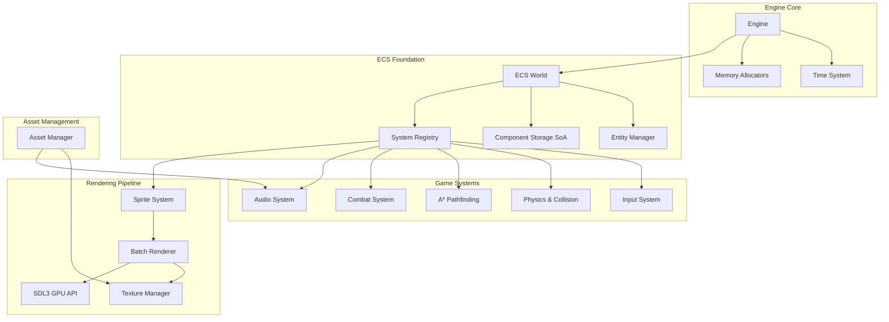
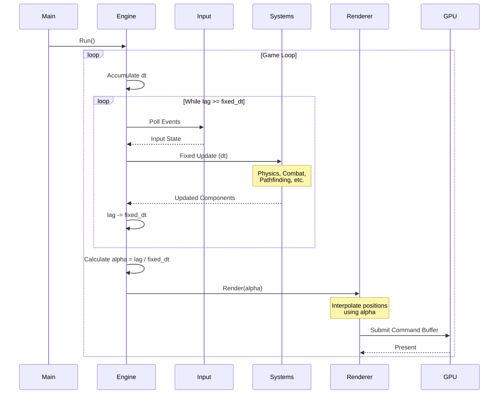

# High-Performance 2D Game Engine Architecture

## Overview
This engine is built on a pure Entity Component System (ECS) architecture with Data-Oriented Design (DoD) principles, leveraging SDL3 and the SDL3 GPU API for high-performance 2D rendering.

## Core Design Principles

### 1. ECS-First Architecture
- **Pure ECS**: Entities are IDs, Components are pure data (SoA layout), Systems are logic
- **Data-Oriented Design**: Structure-of-Arrays (SoA) for cache-line efficiency
- **Zero virtual dispatch**: Systems operate on component arrays directly

### 2. Memory Management
- **Zero-allocation main loop**: All frame allocations use arena/pool allocators
- **Cache-line awareness**: 64-byte alignment for hot data structures
- **Predictable access patterns**: Linear memory traversal in systems

### 3. Fixed Timestep Loop
- **Deterministic updates**: Fixed timestep (e.g., 60 Hz) for physics/logic
- **Interpolated rendering**: Smooth visuals independent of update rate
- **Time control**: Pause, slow-motion, fast-forward support

### 4. GPU-Driven Rendering
- **Batch rendering**: Minimize draw calls via texture atlases and instancing
- **Command buffers**: Decouple CPU and GPU work
- **Transfer buffers**: Async uploads for dynamic geometry

## System Architecture



## Data Flow: Frame Loop



## Module Descriptions

### ECS Core (`include/ecs/`)
- **Entity**: Type-safe entity IDs (32-bit index + 32-bit generation)
- **Component**: SoA storage with cache-friendly iteration
- **System**: Interface for logic operating on component arrays
- **World**: Coordinates entity creation, component storage, system execution

### Memory Management (`include/memory/`)
- **ArenaAllocator**: Linear allocator, reset per frame
- **PoolAllocator**: Fixed-size block allocator for entities/components

### Core Engine (`include/core/`)
- **Engine**: Main loop with fixed timestep and interpolation
- **Time**: Manages game time, pause, time scale

### Rendering (`include/rendering/`)
- **Renderer**: SDL3 GPU batch renderer with instancing
- **Sprite**: Sprite component (texture region, layer, flip flags)
- **Texture**: Texture atlas management and GPU upload

### Physics (`include/physics/`)
- **SpatialPartition**: Grid-based spatial hash for broad-phase collision
- **Collision**: AABB and circle collision components/queries

### Pathfinding (`include/pathfinding/`)
- **AStar**: A* implementation on DoD grid representation

### Audio (`include/audio/`)
- **AudioSystem**: SDL3 audio playback and mixing

### Input (`include/input/`)
- **InputSystem**: Keyboard/mouse/gamepad polling

### Assets (`include/assets/`)
- **AssetManager**: Load and cache textures, audio, data files

### Combat (`include/combat/`)
- **CombatSystem**: Damage calculation, targeting, effects

## Performance Targets
- **Entities**: 10,000+ simultaneous entities
- **Draw Calls**: < 100 per frame via batching
- **Frame Budget**: 16.67ms (60 FPS) with headroom
- **Memory**: Predictable allocation patterns, no frame allocations

## Dependency Management
- **SDL3**: Core windowing, events, GPU API, audio
- **C++20**: Concepts, ranges, spans for type safety
- **No external ECS libraries**: Custom implementation for full control

## File Structure
```
project/
├── docs/
│   └── ARCHITECTURE.md
├── include/
│   ├── ecs/
│   │   ├── Entity.hpp
│   │   ├── Component.hpp
│   │   ├── System.hpp
│   │   └── World.hpp
│   ├── memory/
│   │   ├── ArenaAllocator.hpp
│   │   └── PoolAllocator.hpp
│   ├── core/
│   │   ├── Engine.hpp
│   │   └── Time.hpp
│   ├── rendering/
│   │   ├── Renderer.hpp
│   │   ├── Sprite.hpp
│   │   └── Texture.hpp
│   ├── physics/
│   │   ├── SpatialPartition.hpp
│   │   └── Collision.hpp
│   ├── pathfinding/
│   │   └── AStar.hpp
│   ├── audio/
│   │   └── AudioSystem.hpp
│   ├── input/
│   │   └── InputSystem.hpp
│   ├── assets/
│   │   └── AssetManager.hpp
│   └── combat/
│       └── CombatSystem.hpp
├── src/
│   └── (implementation files mirror include/)
├── external/
│   └── SDL3/
└── CMakeLists.txt
```

## Next Steps
1. Implement header skeletons with interface definitions
2. Create CMake build system
3. Implement core ECS foundation
4. Build rendering pipeline with SDL3 GPU
5. Add subsystems incrementally
6. Profile and optimize hot paths
